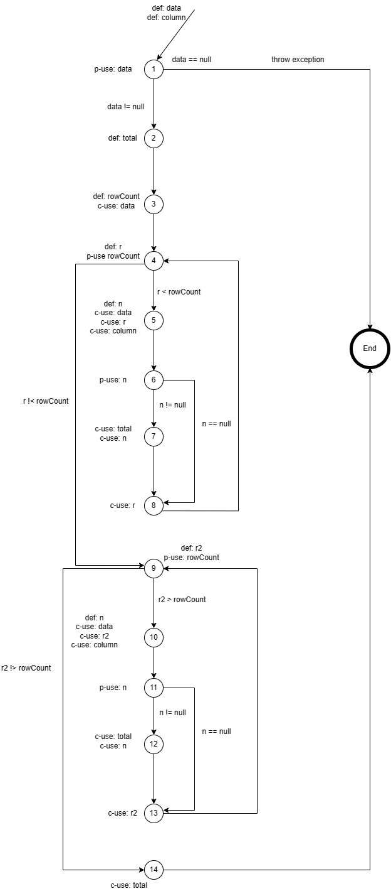
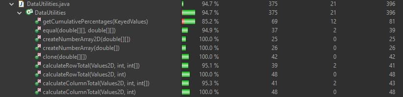
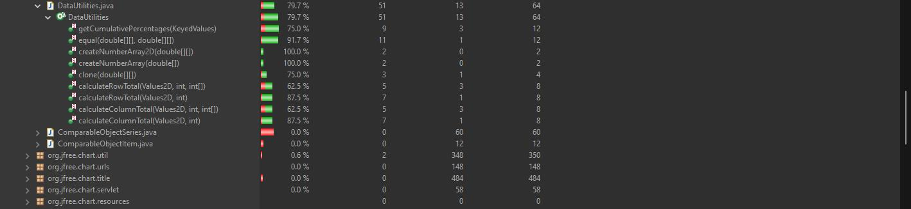
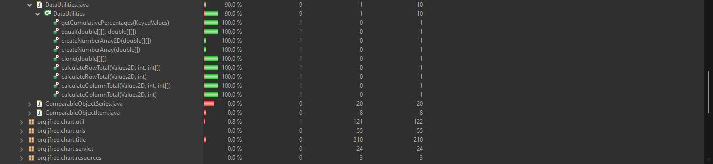

**SENG 438 - Software Testing, Reliability, and Quality**

**Lab. Report \#3 

| Group \#:      |  13 |
| -------------- | --- |
| Student Names: | David Tran    |
|                | Bismarck Leung    |
|                | Shichao Han    |
|                | Zirui Wang    |

# 1 Introduction

The focus of this assignment is similar to the previous one, as it involves unit testing using JUnit in Eclipse. Students will begin by getting familiar with the testing tools before proceeding with the implementation (enhancement) of the test suite. However, this assignment differs from the previous Ass2 in that it introduces us to a new technique for deciding which test cases to develop: white-box coverage criteria.

In this lab, we will expan our unit test suite based on the previous lab. The test will also be developed based on white-box criteria, specifically in statement, branch and method coverage. This lab aim to create serveral more detailed test that fit in high percentage coverage criteria. 

# 2 Manual data-flow coverage calculations
---------------------------------------------------------------------------------------

__Def-path set:__
- du(1, data) = {[1], [1,2,3], [1,2,3,4,5], [1,2,3,4,5,6,7,8,4,5]}
- du(1, column) = {[1], [1,2,3,4,5], [1,2,3,4,5,6,7,8,4,5]}
- du(2, total) = {[2,3,4,9,14], [2,3,4,5,6,7,8,4,9,14], [2,3,4,5,6,8,4,9,14],[2,3,4,9,14],[2,3,4,9,10,11,12,13,9,14],[2,3,4,9,10,11,13,9,14],[2,3,4,5,6,7,8,4,9,14],[2,3,4,5,6,7,8,4,9,10,11,12,13,9,14],[2,3,4,5,6,7,8,4,9,10,11,13,9,14],[2,3,4,5,6,8,4,9,14],[2,3,4,5,6,8,4,9,10,11,12,13,9,14],[2,3,4,5,6,8,4,9,10,11,13,9,14]}
- du(3, rowCount) = {[3,4,9], [3,4,5,6,7,8,4,9], [3,4,5,6,8,4,9],[3,4,9,10,11,12,13,9], [3,4,9,10,11,13,9],[3,4,5,6,7,8,4,9,10,11,12,13,9],[3,4,5,6,7,8,4,9,10,11,13,9],[3,4,5,6,8,4,9,10,11,12,13,9],[3,4,5,6,8,4,9,10,11,13,9]}
- du(4, r) = {[4], [4,5,6,7,8,4], [4,5,6,8,4]}
- du(5, n) = {[5,6], [5,6,7]}
- du(9, r2) = {[9], [9,10,11,12,13,9], [9,10,11,13,9]}
- du(10, n) = {[10,11], [10,11,12]}
 
__Def-pair set:__
- du(1, 1, data) = {[1]}
- du(1, 3, data) = {[1,2,3]}
- du(1, 5, data) = {[1,2,3,4,5], [1,2,3,4,5,6,7,8,4,5]}
- du(1, 1, column) = {[1],}
- du(1, 5, column) = {[1,2,3,4,5], [1,2,3,4,5,6,7,8,4,5],}
- du(2, 14, total) = {[2,3,4,9,14], [2,3,4,5,6,7,8,4,9,14], [2,3,4,5,6,8,4,9,14],[2,3,4,9,14],[2,3,4,9,10,11,12,13,9,14],[2,3,4,9,10,11,13,9,14],[2,3,4,5,6,7,8,4,9,14],[2,3,4,5,6,7,8,4,9,10,11,12,13,9,14],[2,3,4,5,6,7,8,4,9,10,11,13,9,14],[2,3,4,5,6,8,4,9,14],[2,3,4,5,6,8,4,9,10,11,12,13,9,14],[2,3,4,5,6,8,4,9,10,11,13,9,14]}
- du(3, 9, rowCount) = {[3,4,9], [3,4,5,6,7,8,4,9], [3,4,5,6,8,4,9],[3,4,9,10,11,12,13,9], [3,4,9,10,11,13,9],[3,4,5,6,7,8,4,9,10,11,12,13,9],[3,4,5,6,7,8,4,9,10,11,13,9],[3,4,5,6,8,4,9,10,11,12,13,9],[3,4,5,6,8,4,9,10,11,13,9]}
- du(4, 4, r) = {[4], [4,5,6,7,8,4], [4,5,6,8,4]}
- du(5, 6, n) = {[5,6]}
- du(5, 7, n) = {[5,6,7]}
- du(9, 9, r) = {[9], [9,10,11,12,13,9], [9,10,11,13,9]}
- du(10, 11, n) =  {[10,11]}
- du(10, 12, n) = {[10,11,12]}

# 3 Description of the testing strategy for the new unit tests
---------------------------------------------------------------------------------------
Our plan is to determine what was already coded in our previous tests from Assignment 2 and try to understand what we are missing for the plans and tests. By doing this we are able to understand the metrics that we are working with and how we are able to continue improving these two files with more tests. By continuousely checking our metrics and what is covered, we are able to determine what new tests are needed based on what has already been tested and what is being developed to test. We will be using EmlEmma as it works the best with Eclipse as this is our primary tool. 

# 4 Description of five selected test cases, and how they have increased code coverage
---------------------------------------------------------------------------------------

1. calcPosRowPosValNull()
Branch: 20% to 62.5%
Line: 55% to 100%
Method: 100% TO 100%

During our previous tests, we did not account for a lot of the branches that could have occured within the function, whether this be positive or negativeNumbers, by adding these new test cases that allowed for the testing of nulls, positvie and negatie numbers, we are able to establish more tests that covers a greater range of branches that was not present before. 

2. getCumPercentageTestOne() 

Branch: 15% to 75%
Line: 55% to 85.2%
Method: 100% TO 100%

Before, this did not test much of the functions as we did not have access to the code, so the tests previously based off our own knowledge of how cumulative percentages are supposed to work. Now with the new code, we are able to determine how the files are supposed to work and what branches can be used to cover, ex . how KeyedValues works and why they are sued in cumulative percentage

3. cloneTestTwoEmpty()

Branch: 50% to 75%
Line: 55% to 100%
Method: 100% TO 100%

For cloning, we did not understand before that the code uses a for loop for this code, tehrefore, for lines 102-111, we are now able to test these specific lines as they are part of the code for the for loop and if statements that are present within the code. By testing the null values, we are able to test if the loops are handling null values correctly. 

# 5 Report of the coverage achieved of each class and method
---------------------------------------------------------------------------------------
Datautilities Statement Coverage

Datautilities Branch Coverage

Datautilities Method Coverage

# 6 Pros and cons of the coverage tools tried by your group in this assignment
---------------------------------------------------------------------------------------
This lab is completed useing EclEmma as the tools for measure coverage. It was easy to setup because it is integrated with eclipse IDE. The three metrics used to measure the coverage are statement(line), branch, and method. Since EclEmma does not provicde condition coverage so we switched to method coverage. Overall, EclEmma is very good tool for test coverages, it privide many other coverage measurement beside the three we choose to use. It also provide colour highlight feedback on the code for easy to find which lines of code has error. However the highlight colour might be too dark therfore it is hard to read the code. It also provide feedback on which lines of code is coveraged for statement coverage measurement, which can be helpful for us to improve test code for statement coverage. However for branch coverage, it does not provide enough information to specifit number of state, where this made improving branch coverage and debugging.  

# 7 A comparison on the advantages and disadvantages of requirements-based test generation and coverage-based test generation.
1. Advantages of Requirements-based Test Generation: The first thing is focusing on the user's needs. It ensures that the software meets the requirements and helps create test cases that cover all functional requirements. Secondly, This approach provides traceability from the requirements to test cases, making it easy to track testing progress. Moreover, It will help the software by identifying and testing all the requirements thoroughly.
2. Advantages of Coverage-based Test Generation: It will ensure that all the code is executed during testing and provide quick results since it focuses on code coverage rather than requirements. Also, it can be easily scaled to large software systems.
3. Disadvantages of Requirements-based Test Generation: It only focuses on the functional requirements, which can lead to insufficient testing of non-functional requirements like performance and security. Also, it takes work to generate suitable test cases.
4. Disadvantages of Coverage-based Test Generation: It only tests the code written, but it may only test some of the functional requirements. The code coverage metrics do not necessarily indicate adequate software testing since it is possible to have high code coverage but still have defects in the software. Moreover, it requires maintenance since it needs to be updated whenever the code changes.

# 8 Dscussion on how the team work/effort was divided and managed
---------------------------------------------------------------------------------------

# 9 Any difficulties encountered, challenges overcome, and lessons learned from performing the assignment
When we worked together, we realized that it could be challenging to coordinate schedules and ensure that everyone is working on the same page. Also, we found that Writing practical JUnit tests with a clear understanding of the codebase can be more accessible, which may lead to ineffective tests or false positives. On the other hand, we can overcome coordination issues by maintaining open communication channels and regularly checking in on each other's progress. Additionally, Writing practical JUnit tests is crucial for ensuring software quality and detecting defects early in the development process, and it helps us better understand this knowledge.

# 10 Comments/feedback on the assignment itself
---------------------------------------------------------------------------------------
The code setup was a hassle especially given the missing hamcrest library, which is only included in the assignment 2 code. The library importing is also a lot of work where it is easy to miss import library which will cause the code to not run properly. Beside libraries, it is also difficult to set up git repository for everyone to collaborate.  
